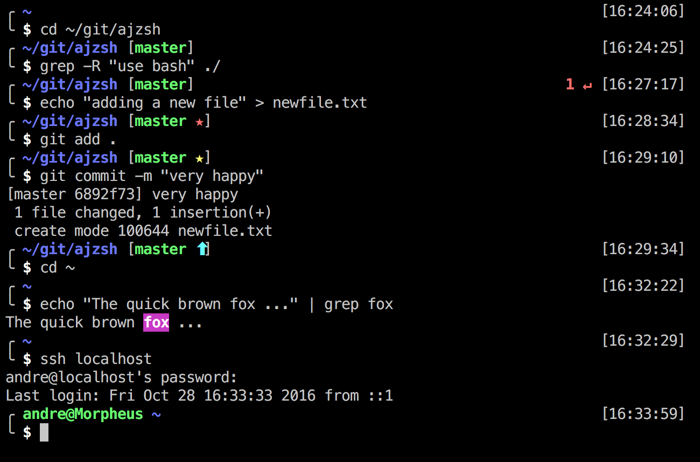

# ajzsh

> André Jacobs' Z shell configuration.

## Overview

Once you have tried [Zsh](https://en.wikipedia.org/wiki/Z_shell) you will never go back to bash.

To see what is possible with Zsh take a look at [oh my zsh](http://ohmyz.sh/)

I wanted to have my own minimalist custom configuration for Zsh and not be overloaded with bigger packages like [oh my zsh](http://ohmyz.sh/).

### Features

- Two-line command prompt with the first line used for displaying info.
- Shows the current directory and a 24 hour clock at the time the prompt is displayed.
- Displays the current `git` branch and a status indicator: 
    - ★ shows that you have commits to be made.
    - ⬆ shows that you have changes to be pushed upstream.
    - ⬇ shows that there are changes to be pulled from upstream.
    - ⬇⬆ your branch is diverging from upstream and will need to be resolved.
- Displays the exit code from the last executed command if an error occurred.
- Username and hostname are only displayed when you are in an SSH session.

## Install

The following steps can be done if you have already installed Zsh. See the next section if you need help to install Zsh.

1. Launch Zsh:

        zsh

2. Clone this repository or download a copy:

        git clone --recursive https://github.com/andrejacobs/ajzsh.git ajzsh

3. Run the installation script:

        cd ajzsh
        ./install.sh

4. Relaunch your terminal.

## Installing Zsh

- Confirm current version of Zsh: `zsh --version`
- Expected result: `zsh 5.2` or more recent.
- Install Zsh using either `brew install zsh` with [homebrew](http://brew.sh/) on macOS or `sudo apt-get install zsh` on Ubuntu.
- Get the path to the binary using `which zsh`
    - Using homebrew on macOS will give you `/usr/local/bin/zsh`
- Add the path to the file /etc/shells
- Change your default shell to be Zsh
    - On macOS: `sudo dscl . -create /Users/$USER UserShell /usr/local/bin/zsh`
    - On Linux: `sudo chsh -s "$(command -v zsh)" "${USER}"`
- Relaunch your terminal and verify that `echo $SHELL` points to the correct path to the Zsh binary.

## Acknowledgements

This is based on the work of [ze-best-zsh-config](https://github.com/spicycode/ze-best-zsh-config)

Other inspirations were:

- [pure](https://github.com/sindresorhus/pure)
- [prezto](https://github.com/sorin-ionescu/prezto)
- [oh-my-zsh](http://ohmyz.sh/)

## Disclaimer

This have only been tested on macOS Sierra. I will be using this on Ubuntu shortly and I am sure to run into many joys of fixing bugs :-)

### To-do

* Add some aliasses for git
* Add some macOS specifics (like aliases for working with finder)
* Fix the completion bug (because of 2line prompt [i.e. type l and tab])
* Check file permissions are correct

